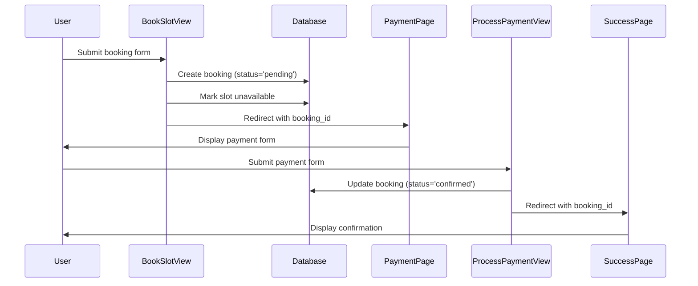
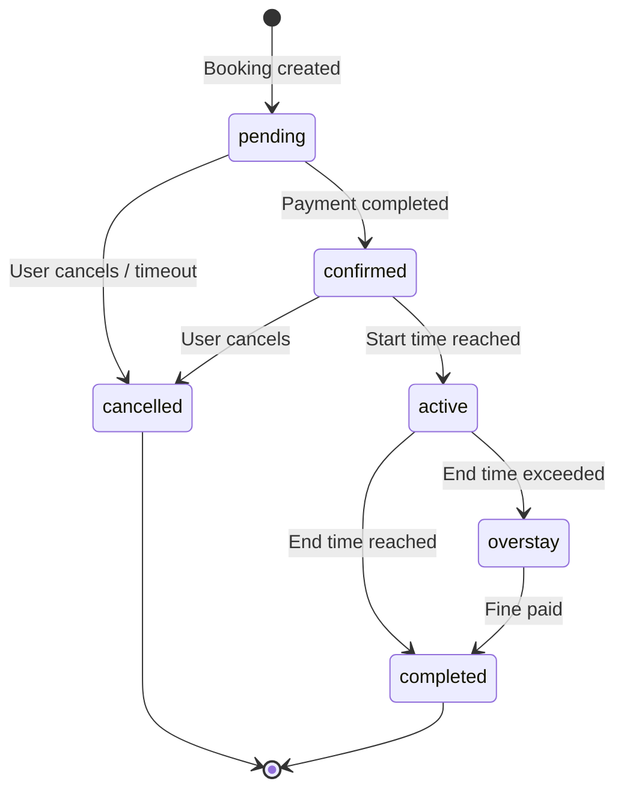

# Design Document: Demo Payment Flow

## Overview

This design document specifies the technical implementation for adding a simulated payment flow to the SmartPark parking booking system. The feature introduces an intermediate payment step between booking creation and confirmation, transforming the current single-step booking process into a three-stage workflow: booking creation → payment processing → confirmation.

The payment flow is a demonstration feature that simulates credit card payment processing without integrating with real payment gateways. It serves to showcase a realistic booking workflow while maintaining the simplicity of a demo application.

### Key Design Decisions

1. **Status-Based State Machine**: Use the existing Booking model's status field to track payment state transitions (pending → confirmed)
2. **Slot Reservation on Creation**: Mark slots as unavailable immediately upon booking creation (pending status) to prevent double-booking
3. **Client-Side Validation**: Use HTML5 form validation for payment form fields to provide immediate user feedback
4. **Split-Screen UI Pattern**: Reuse the existing auth page design pattern (login/register) for visual consistency
5. **No Payment Gateway Integration**: Implement a simulated payment process that always succeeds for demo purposes

## Architecture

### High-Level Payment Flow



### State Transition Diagram



### Component Interaction

The payment flow integrates with existing components:

- **Models**: Extends Booking model with default status change
- **Views**: Adds three new views (payment_page, process_payment, booking_success) and modifies book_slot
- **URLs**: Adds three new URL patterns for payment flow
- **Templates**: Adds two new templates (payment.html, booking_success.html)
- **Forms**: Uses HTML5 validation, no Django form class needed for payment

## Components and Interfaces

### 1. Modified Booking Model

**File**: `parking/models.py`

**Changes**:
- Update default status from 'confirmed' to 'pending'

```python
class Booking(models.Model):
    STATUS_CHOICES = [
        ('pending',   'Pending'),
        ('confirmed', 'Confirmed'),
        ('active',    'Active'),
        ('completed', 'Completed'),
        ('overstay',  'Overstay — Fine Applied'),
        ('cancelled', 'Cancelled'),
    ]
    # ... other fields ...
    status = models.CharField(
        max_length=20, 
        choices=STATUS_CHOICES, 
        default='pending'  # Changed from 'confirmed'
    )
```

**Rationale**: Changing the default ensures new bookings start in pending state, requiring payment completion before confirmation.

### 2. Updated book_slot View

**File**: `parking/views.py`

**Signature**:
```python
@login_required
def book_slot(request, slot_id):
    # Returns: redirect to payment_page with booking_id
```

**Changes**:
- Remove explicit `status='confirmed'` assignment (use model default 'pending')
- Change redirect from 'my_bookings' to 'payment_page' with booking_id parameter
- Keep slot.is_available = False logic (reserve slot immediately)

**Modified Logic**:
```python
booking = form.save(commit=False)
booking.user = request.user
booking.slot = slot
booking.vehicle = vehicle
# status defaults to 'pending' from model
booking.save()

slot.is_available = False
slot.save()

# Redirect to payment instead of my_bookings
return redirect('payment_page', booking_id=booking.id)
```

### 3. New payment_page View

**File**: `parking/views.py`

**Signature**:
```python
@login_required
def payment_page(request, booking_id):
    # Returns: render payment.html with booking context
```

**Responsibilities**:
- Retrieve booking by ID
- Verify booking belongs to current user
- Verify booking status is 'pending'
- Calculate booking duration for display
- Render payment form template

**Implementation**:
```python
@login_required
def payment_page(request, booking_id):
    booking = get_object_or_404(Booking, id=booking_id, user=request.user)
    
    # If already confirmed, redirect to success page
    if booking.status != 'pending':
        return redirect('booking_success', booking_id=booking.id)
    
    # Calculate duration for display
    duration = booking.end_time - booking.start_time
    duration_hours = duration.total_seconds() / 3600
    
    context = {
        'booking': booking,
        'duration_hours': round(duration_hours, 1),
    }
    return render(request, 'payment.html', context)
```

**Error Handling**:
- 404 if booking doesn't exist or doesn't belong to user
- Redirect to success if already confirmed (idempotent)

### 4. New process_payment View

**File**: `parking/views.py`

**Signature**:
```python
@login_required
def process_payment(request, booking_id):
    # Returns: redirect to booking_success with booking_id
```

**Responsibilities**:
- Accept POST requests only
- Retrieve booking by ID
- Verify booking belongs to current user
- Update booking status from 'pending' to 'confirmed'
- Redirect to success page

**Implementation**:
```python
@login_required
def process_payment(request, booking_id):
    if request.method != 'POST':
        return redirect('payment_page', booking_id=booking_id)
    
    booking = get_object_or_404(Booking, id=booking_id, user=request.user)
    
    # Update status to confirmed
    booking.status = 'confirmed'
    booking.save()
    
    messages.success(request, 'Payment successful! Your booking is confirmed.')
    return redirect('booking_success', booking_id=booking.id)
```

**Security Considerations**:
- User authentication required via @login_required
- Ownership verification via user=request.user filter
- POST-only to prevent accidental GET-based confirmation

### 5. New booking_success View

**File**: `parking/views.py`

**Signature**:
```python
@login_required
def booking_success(request, booking_id):
    # Returns: render booking_success.html with booking context
```

**Responsibilities**:
- Retrieve confirmed booking by ID
- Verify booking belongs to current user
- Display booking confirmation details
- Provide navigation to my_bookings and home

**Implementation**:
```python
@login_required
def booking_success(request, booking_id):
    booking = get_object_or_404(Booking, id=booking_id, user=request.user)
    
    # Calculate duration for display
    duration = booking.end_time - booking.start_time
    duration_hours = duration.total_seconds() / 3600
    
    context = {
        'booking': booking,
        'duration_hours': round(duration_hours, 1),
    }
    return render(request, 'booking_success.html', context)
```

### 6. URL Routing

**File**: `parking/urls.py`

**New URL Patterns**:
```python
urlpatterns = [
    # ... existing patterns ...
    path('payment/<int:booking_id>/', views.payment_page, name='payment_page'),
    path('process-payment/<int:booking_id>/', views.process_payment, name='process_payment'),
    path('booking-success/<int:booking_id>/', views.booking_success, name='booking_success'),
]
```

**URL Structure**:
- `/payment/<booking_id>/` - Display payment form
- `/process-payment/<booking_id>/` - Handle payment submission (POST only)
- `/booking-success/<booking_id>/` - Display confirmation

**Design Rationale**:
- Booking ID in URL allows direct access and bookmarking
- Separate URLs for display vs. processing follows RESTful patterns
- All URLs require authentication via view decorators

## Data Models

### Booking Model Changes

**Migration Required**: Yes

**Field Changes**:
```python
# Before
status = models.CharField(max_length=20, choices=STATUS_CHOICES, default='confirmed')

# After
status = models.CharField(max_length=20, choices=STATUS_CHOICES, default='pending')
```

**Migration Command**:
```bash
python manage.py makemigrations parking
python manage.py migrate parking
```

**Migration Impact**:
- Existing bookings retain their current status values
- Only new bookings created after migration will default to 'pending'
- No data loss or corruption risk

### Booking Status State Machine

**Valid Transitions**:
- `pending` → `confirmed` (payment completed)
- `pending` → `cancelled` (user cancels or timeout)
- `confirmed` → `active` (start time reached)
- `confirmed` → `cancelled` (user cancels before start)
- `active` → `completed` (end time reached normally)
- `active` → `overstay` (end time exceeded)
- `overstay` → `completed` (fine paid or resolved)

**Invalid Transitions** (should be prevented):
- `confirmed` → `pending` (cannot un-confirm)
- `completed` → any other state (terminal state)
- `cancelled` → any other state (terminal state)

## Templates

### 1. payment.html

**Location**: `templates/payment.html`

**Layout**: Split-screen design matching login.html pattern

**Structure**:
```html


<div class="auth-page">
    <div class="auth-wrapper">
        <!-- Left Panel: Branding -->
        <div class="auth-left">
            <div class="auth-left-content">
                <div class="auth-logo">
                    <i class="fas fa-parking"></i> SmartPark
                </div>
                <h2>Secure Payment<br>Quick Checkout<br>Park with Confidence</h2>
                <div class="auth-features">
                    <div class="auth-feature">
                        <i class="fas fa-lock"></i>
                        <span>Secure payment processing</span>
                    </div>
                    <div class="auth-feature">
                        <i class="fas fa-credit-card"></i>
                        <span>All major cards accepted</span>
                    </div>
                    <div class="auth-feature">
                        <i class="fas fa-check-circle"></i>
                        <span>Instant booking confirmation</span>
                    </div>
                </div>
            </div>
        </div>

        <!-- Right Panel: Payment Form -->
        <div class="auth-right">
            <div class="auth-card">
                <div class="auth-icon-wrap">
                    <i class="fas fa-credit-card"></i>
                </div>
                <h2>Complete Payment</h2>
                <p class="auth-subtitle">Booking Details</p>

                <!-- Booking Summary -->
                <div class="booking-summary">
                    <div class="summary-row">
                        <span>Slot:</span>
                        <strong>{{ booking.slot.slot_number }}</strong>
                    </div>
                    <div class="summary-row">
                        <span>Location:</span>
                        <strong>{{ booking.slot.lot.name }}</strong>
                    </div>
                    <div class="summary-row">
                        <span>Duration:</span>
                        <strong>{{ duration_hours }} hours</strong>
                    </div>
                    <div class="summary-row highlight">
                        <span>Total:</span>
                        <strong>₹{{ booking.total_cost }}</strong>
                    </div>
                </div>

                <!-- Payment Form -->
                <form method="POST" action="">
                    
                    
                    <div class="form-group">
                        <label><i class="fas fa-credit-card"></i> Card Number</label>
                        <input type="text" name="card_number" required
                               pattern="[0-9]{16}"
                               placeholder="1234 5678 9012 3456"
                               maxlength="16">
                    </div>

                    <div class="form-group">
                        <label><i class="fas fa-user"></i> Cardholder Name</label>
                        <input type="text" name="card_name" required
                               placeholder="John Doe">
                    </div>

                    <div class="form-row-2">
                        <div class="form-group">
                            <label><i class="fas fa-calendar"></i> Expiry</label>
                            <input type="text" name="expiry" required
                                   pattern="(0[1-9]|1[0-2])\/[0-9]{2}"
                                   placeholder="MM/YY"
                                   maxlength="5">
                        </div>
                        <div class="form-group">
                            <label><i class="fas fa-lock"></i> CVV</label>
                            <input type="text" name="cvv" required
                                   pattern="[0-9]{3,4}"
                                   placeholder="123"
                                   maxlength="4">
                        </div>
                    </div>

                    <button type="submit" class="btn-primary btn-block btn-large">
                        <i class="fas fa-check-circle"></i> Complete Payment
                    </button>
                </form>

                <p class="payment-note">
                    <i class="fas fa-info-circle"></i>
                    This is a demo payment form. No real charges will be made.
                </p>
            </div>
        </div>
    </div>
</div>
```

**CSS Classes Used** (from existing style.css):
- `.auth-page`, `.auth-wrapper` - Split-screen container
- `.auth-left`, `.auth-right` - Left/right panels
- `.auth-card` - Form card styling
- `.form-group`, `.form-row-2` - Form layout
- `.btn-primary`, `.btn-block`, `.btn-large` - Button styling

**New CSS Required**:
```css
.booking-summary {
    background: var(--gray-light);
    border-radius: var(--radius-sm);
    padding: 1rem;
    margin-bottom: 1.5rem;
}

.summary-row {
    display: flex;
    justify-content: space-between;
    padding: 0.5rem 0;
    font-size: 0.9rem;
}

.summary-row.highlight {
    background: var(--primary-light);
    margin: 0.5rem -1rem 0;
    padding: 0.7rem 1rem;
    border-radius: var(--radius-sm);
    font-size: 1rem;
}

.summary-row.highlight strong {
    color: var(--primary);
    font-size: 1.2rem;
}

.payment-note {
    text-align: center;
    font-size: 0.8rem;
    color: var(--gray);
    margin-top: 1rem;
    display: flex;
    align-items: center;
    justify-content: center;
    gap: 0.4rem;
}
```

### 2. booking_success.html

**Location**: `templates/booking_success.html`

**Layout**: Centered success card with booking details

**Structure**:
```html


<div class="success-page">
    <div class="container">
        <div class="success-card">
            <div class="success-icon">
                <i class="fas fa-check-circle"></i>
            </div>
            <h1>Booking Confirmed!</h1>
            <p class="success-subtitle">Your parking slot has been reserved</p>

            <div class="booking-details-card">
                <h3><i class="fas fa-info-circle"></i> Booking Details</h3>
                <div class="detail-row">
                    <span>Booking ID:</span>
                    <strong>#{{ booking.id }}</strong>
                </div>
                <div class="detail-row">
                    <span>Slot Number:</span>
                    <strong>{{ booking.slot.slot_number }}</strong>
                </div>
                <div class="detail-row">
                    <span>Parking Lot:</span>
                    <strong>{{ booking.slot.lot.name }}</strong>
                </div>
                <div class="detail-row">
                    <span>Address:</span>
                    <strong>{{ booking.slot.lot.address }}</strong>
                </div>
                <div class="detail-row">
                    <span>Start Time:</span>
                    <strong>{{ booking.start_time|date:"M d, Y g:i A" }}</strong>
                </div>
                <div class="detail-row">
                    <span>End Time:</span>
                    <strong>{{ booking.end_time|date:"M d, Y g:i A" }}</strong>
                </div>
                <div class="detail-row">
                    <span>Duration:</span>
                    <strong>{{ duration_hours }} hours</strong>
                </div>
                <div class="detail-row highlight">
                    <span>Total Paid:</span>
                    <strong>₹{{ booking.total_cost }}</strong>
                </div>
            </div>

            <div class="success-actions">
                <a href="" class="btn-primary btn-large">
                    <i class="fas fa-list"></i> View My Bookings
                </a>
                <a href="" class="btn-outline btn-large">
                    <i class="fas fa-home"></i> Back to Home
                </a>
            </div>
        </div>
    </div>
</div>
```

**New CSS Required**:
```css
.success-page {
    min-height: calc(100vh - 130px);
    display: flex;
    align-items: center;
    justify-content: center;
    padding: 2rem 1.5rem;
    background: var(--gray-light);
}

.success-card {
    background: var(--white);
    border-radius: var(--radius-lg);
    padding: 3rem 2.5rem;
    max-width: 600px;
    width: 100%;
    text-align: center;
    box-shadow: var(--shadow-md);
}

.success-icon {
    width: 80px;
    height: 80px;
    background: var(--success-light);
    border-radius: 50%;
    display: flex;
    align-items: center;
    justify-content: center;
    margin: 0 auto 1.5rem;
    font-size: 2.5rem;
    color: var(--success);
}

.success-card h1 {
    font-size: 1.8rem;
    margin-bottom: 0.5rem;
    color: var(--dark);
}

.success-subtitle {
    color: var(--gray);
    font-size: 1rem;
    margin-bottom: 2rem;
}

.booking-details-card {
    background: var(--gray-light);
    border-radius: var(--radius-md);
    padding: 1.5rem;
    margin-bottom: 2rem;
    text-align: left;
}

.booking-details-card h3 {
    font-size: 1rem;
    font-weight: 600;
    margin-bottom: 1rem;
    padding-bottom: 0.8rem;
    border-bottom: 1px solid var(--border);
    display: flex;
    align-items: center;
    gap: 0.5rem;
    color: var(--gray);
}

.detail-row {
    display: flex;
    justify-content: space-between;
    padding: 0.6rem 0;
    border-bottom: 1px solid rgba(0,0,0,0.05);
    font-size: 0.9rem;
}

.detail-row:last-child {
    border-bottom: none;
}

.detail-row span {
    color: var(--gray);
}

.detail-row strong {
    color: var(--dark);
}

.detail-row.highlight {
    background: var(--success-light);
    margin: 0.5rem -1rem 0;
    padding: 0.8rem 1rem;
    border-radius: var(--radius-sm);
    border-bottom: none;
}

.detail-row.highlight strong {
    color: var(--success);
    font-size: 1.1rem;
}

.success-actions {
    display: flex;
    gap: 1rem;
    justify-content: center;
    flex-wrap: wrap;
}

@media (max-width: 768px) {
    .success-actions {
        flex-direction: column;
    }
    .success-actions a {
        width: 100%;
    }
}
```

## Form Validation

### Client-Side Validation Strategy

**Approach**: HTML5 form validation with pattern attributes

**Validation Rules**:

1. **Card Number**:
   - Required: Yes
   - Pattern: `[0-9]{16}` (exactly 16 digits)
   - Maxlength: 16
   - Error message: "Please enter a valid 16-digit card number"

2. **Cardholder Name**:
   - Required: Yes
   - Pattern: None (any text)
   - Error message: "Please enter the cardholder name"

3. **Expiry Date**:
   - Required: Yes
   - Pattern: `(0[1-9]|1[0-2])\/[0-9]{2}` (MM/YY format)
   - Maxlength: 5
   - Error message: "Please enter expiry in MM/YY format"

4. **CVV**:
   - Required: Yes
   - Pattern: `[0-9]{3,4}` (3 or 4 digits)
   - Maxlength: 4
   - Error message: "Please enter a valid 3 or 4 digit CVV"

**Implementation**:
```html
<input type="text" name="card_number" required
       pattern="[0-9]{16}"
       placeholder="1234 5678 9012 3456"
       maxlength="16"
       title="Please enter a valid 16-digit card number">
```

**Browser Support**: HTML5 validation is supported in all modern browsers (Chrome, Firefox, Safari, Edge)

**Fallback**: Server-side validation not required for demo purposes, but form submission will be rejected by browser if validation fails

### Server-Side Processing

**No validation required** in process_payment view because:
1. This is a demo feature with no real payment processing
2. Client-side validation prevents invalid submissions
3. The view only updates booking status, doesn't process payment data
4. Payment form data is not saved to database

**Security Note**: In a production system, server-side validation and payment gateway integration would be mandatory.

## Error Handling

### Error Scenarios and Responses

1. **Booking Not Found**:
   - Trigger: Invalid booking_id in URL
   - Response: 404 error via get_object_or_404
   - User Experience: Django 404 page

2. **Unauthorized Access**:
   - Trigger: User tries to access another user's booking
   - Response: 404 error via user=request.user filter
   - User Experience: Django 404 page

3. **Already Confirmed Booking**:
   - Trigger: User accesses payment page for confirmed booking
   - Response: Redirect to booking_success page
   - User Experience: See confirmation page (idempotent)

4. **GET Request to process_payment**:
   - Trigger: User navigates directly to process_payment URL
   - Response: Redirect to payment_page
   - User Experience: Redirected back to payment form

5. **Unauthenticated Access**:
   - Trigger: Non-logged-in user accesses payment URLs
   - Response: Redirect to login page via @login_required
   - User Experience: Login prompt with next parameter

### Error Handling Implementation

```python
# In payment_page view
@login_required
def payment_page(request, booking_id):
    # 404 if booking doesn't exist or doesn't belong to user
    booking = get_object_or_404(Booking, id=booking_id, user=request.user)
    
    # Idempotent: redirect if already confirmed
    if booking.status != 'pending':
        return redirect('booking_success', booking_id=booking.id)
    
    # ... render payment form ...

# In process_payment view
@login_required
def process_payment(request, booking_id):
    # Reject GET requests
    if request.method != 'POST':
        return redirect('payment_page', booking_id=booking_id)
    
    # 404 if booking doesn't exist or doesn't belong to user
    booking = get_object_or_404(Booking, id=booking_id, user=request.user)
    
    # ... update status and redirect ...
```

## Testing Strategy

This feature involves UI interactions, form submissions, and database state changes. The testing strategy combines unit tests for view logic and integration tests for the complete payment flow.

### Unit Tests

**Test File**: `parking/tests.py`

**Test Cases**:

1. **test_booking_default_status_is_pending**:
   - Create a new Booking instance without specifying status
   - Assert status equals 'pending'

2. **test_book_slot_creates_pending_booking**:
   - Submit valid booking form
   - Assert booking status is 'pending'
   - Assert slot is marked unavailable

3. **test_book_slot_redirects_to_payment**:
   - Submit valid booking form
   - Assert redirect to payment_page with booking_id

4. **test_payment_page_displays_booking_details**:
   - Access payment_page with valid booking_id
   - Assert response contains slot number, lot name, total cost

5. **test_payment_page_redirects_if_already_confirmed**:
   - Create confirmed booking
   - Access payment_page
   - Assert redirect to booking_success

6. **test_process_payment_updates_status_to_confirmed**:
   - Create pending booking
   - POST to process_payment
   - Assert booking status is 'confirmed'

7. **test_process_payment_redirects_to_success**:
   - POST to process_payment with valid booking_id
   - Assert redirect to booking_success

8. **test_process_payment_rejects_get_requests**:
   - GET to process_payment
   - Assert redirect to payment_page

9. **test_booking_success_displays_confirmation**:
   - Access booking_success with valid booking_id
   - Assert response contains booking details

10. **test_unauthorized_user_cannot_access_payment**:
    - User A creates booking
    - User B tries to access payment_page
    - Assert 404 response

### Integration Tests

**Test Scenarios**:

1. **test_complete_payment_flow**:
   - Login as user
   - Submit booking form
   - Verify redirect to payment page
   - Submit payment form
   - Verify redirect to success page
   - Verify booking status is 'confirmed'
   - Verify slot is unavailable

2. **test_payment_form_validation**:
   - Access payment page
   - Submit form with invalid card number
   - Verify browser validation prevents submission (requires Selenium)

3. **test_idempotent_payment_confirmation**:
   - Complete payment flow
   - Access payment_page again with same booking_id
   - Verify redirect to success page (no duplicate confirmation)

### Manual Testing Checklist

- [ ] Create booking and verify redirect to payment page
- [ ] Verify payment form displays correct booking details
- [ ] Submit payment form with valid data
- [ ] Verify redirect to success page
- [ ] Verify booking appears in "My Bookings" with confirmed status
- [ ] Verify slot is marked unavailable
- [ ] Test form validation with invalid card number
- [ ] Test form validation with invalid expiry date
- [ ] Test form validation with invalid CVV
- [ ] Test accessing payment page for another user's booking (should 404)
- [ ] Test accessing payment page when not logged in (should redirect to login)
- [ ] Test accessing payment page for already confirmed booking (should redirect to success)

### Database Migration Testing

**Test Steps**:
1. Run `python manage.py makemigrations parking`
2. Verify migration file is created
3. Run `python manage.py migrate parking`
4. Verify migration applies without errors
5. Create new booking and verify default status is 'pending'
6. Verify existing bookings retain their status values

## Implementation Checklist

### Phase 1: Model and Migration
- [ ] Update Booking model default status to 'pending'
- [ ] Generate migration file
- [ ] Apply migration to database
- [ ] Test migration on development database

### Phase 2: Views
- [ ] Modify book_slot view to redirect to payment_page
- [ ] Implement payment_page view
- [ ] Implement process_payment view
- [ ] Implement booking_success view
- [ ] Add error handling to all views

### Phase 3: URL Routing
- [ ] Add payment_page URL pattern
- [ ] Add process_payment URL pattern
- [ ] Add booking_success URL pattern
- [ ] Test URL routing

### Phase 4: Templates
- [ ] Create payment.html template
- [ ] Create booking_success.html template
- [ ] Add CSS for booking summary
- [ ] Add CSS for success page
- [ ] Test responsive design

### Phase 5: Testing
- [ ] Write unit tests for views
- [ ] Write integration tests for payment flow
- [ ] Run all tests and verify passing
- [ ] Perform manual testing

### Phase 6: Documentation
- [ ] Update README with payment flow documentation
- [ ] Document demo payment credentials (if any)
- [ ] Add screenshots to documentation
